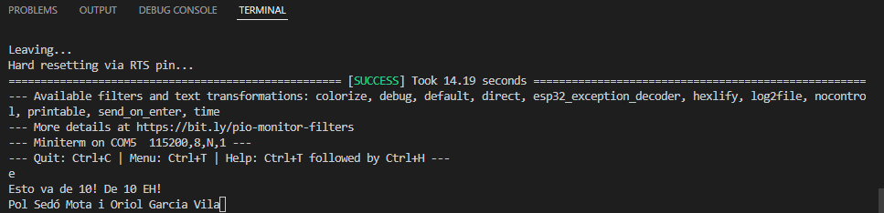

# PRÁCTICA 8: Buses de comunicación IV (uart):
## Codigo fuente operativo:

```cpp
#include <Arduino.h>

void setup() 
{

  Serial.begin(115200);
  Serial2.begin(115200);

}

void loop()
{
  if(Serial.available())
  {
    Serial2.write(Serial.read());
    delay(2);
    if(Serial2.available())
    {
      Serial.write(Serial2.read());
    } 
  }

}
```

## Descripción del mismo:
Incluimos la librería de arduino:
```cpp
#include <Arduino.h>
```
Iniciamlizamos las dos comunicaciones Serial en el void.setup():
```cpp
void setup() 
{

  Serial.begin(115200);
  Serial2.begin(115200);

}
```

Ahora, dentro del loop, utilizaremos "serial.avaliable()" para leer por el puerto serie los caracteres que se vayan monitoreando por el programa. Después, utilizamos el "Serial2.write(Serial.read())" para escribir caracteres y seguidamente que sean leidos por el primer serial. 
El uso del delay es para dejar un tiempo al escribir.
Finalmente, hacemos una secuencia if, para que si se lee algun caracter por el puerto serie, se escriba y lea también  por el Serial2
```cpp
void loop() {
  if(Serial.available()){
    Serial2.write(Serial.read());
    delay(2);
    if(Serial2.available()){
      Serial.write(Serial2.read());
    } 
  }
}
```

## Salidas y entradas de consola:

Por consola se ve lo que se introduce por teclado.

 